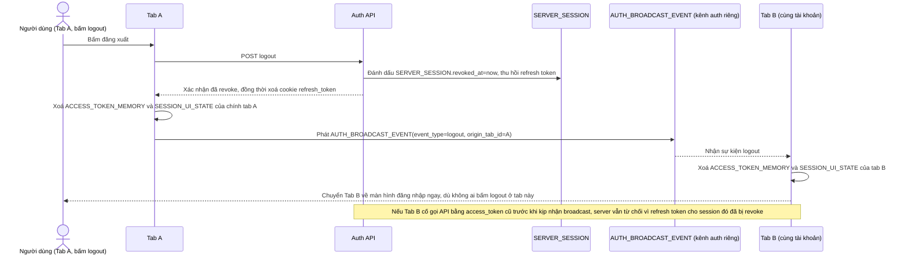

# Enhance sequence — Logout đồng bộ mọi tab đang mở

Đây là **enhance**, cùng flow "logout" như ở base nhưng thay đổi ở chỗ: đăng xuất ở 1 tab phải làm mất hiệu lực token ở toàn bộ tab đang mở, không chỉ tab bấm logout, và dữ liệu phi nhạy cảm trong sessionStorage cũng phải được xoá sạch ở mọi tab. Đáp ứng yêu cầu 2 của đề bài.

