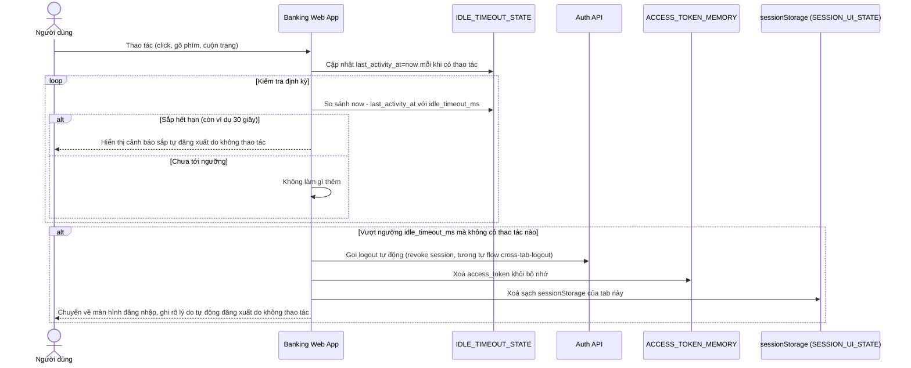

# Enhance sequence — Auto-logout theo idle timeout cho máy dùng chung

Đây là **enhance**, flow hoàn toàn mới, dành cho máy dùng chung (quầy giao dịch, máy tính công cộng). sessionStorage tự xoá khi đóng tab là chưa đủ vì nhân viên sau có thể dùng lại tab đang mở sẵn; hệ thống cần chủ động đếm thời gian không thao tác và tự đăng xuất, xoá rõ ràng toàn bộ cache/state, không phụ thuộc vào việc user có đóng tab hay không. Đáp ứng yêu cầu 3 của đề bài.

