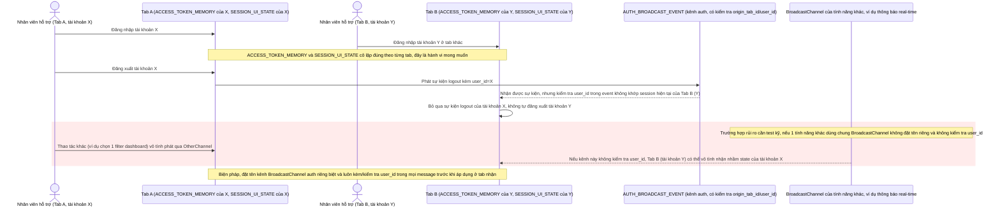

# Enhance sequence — Kiểm tra cô lập giữa 2 tab dùng 2 tài khoản khác nhau

Đây là **enhance**, flow hoàn toàn mới, mô tả kịch bản kiểm thử khi nhân viên hỗ trợ vô tình mở 2 tab với 2 tài khoản khác nhau để test. Vì sessionStorage và biến bộ nhớ JS cô lập theo từng tab nên đây là hành vi đúng, nhưng phải kiểm tra kỹ để đảm bảo không có state nào rò rỉ qua cơ chế dùng chung khác, ví dụ kênh BroadcastChannel của một tính năng không liên quan tới auth. Đáp ứng yêu cầu 4 của đề bài.

