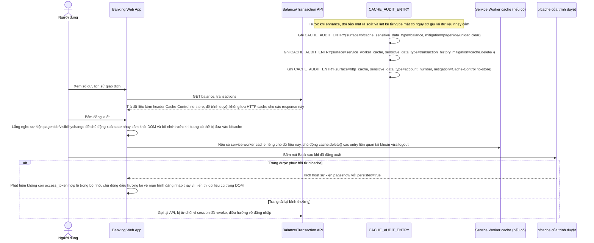

# Enhance sequence — Audit cache nhạy cảm và chặn xem lại bằng nút Back sau logout

Đây là **enhance**, cùng ý tưởng flow "logout" ở base nhưng bổ sung phần audit và chặn rò rỉ qua các lớp cache của trình duyệt. Sau khi logout, hệ thống phải đảm bảo không nơi nào (bfcache, service worker cache, HTTP cache) còn giữ lại dữ liệu nhạy cảm như số dư, số tài khoản, lịch sử giao dịch để có thể xem lại bằng nút Back. Đáp ứng yêu cầu 5 của đề bài.

