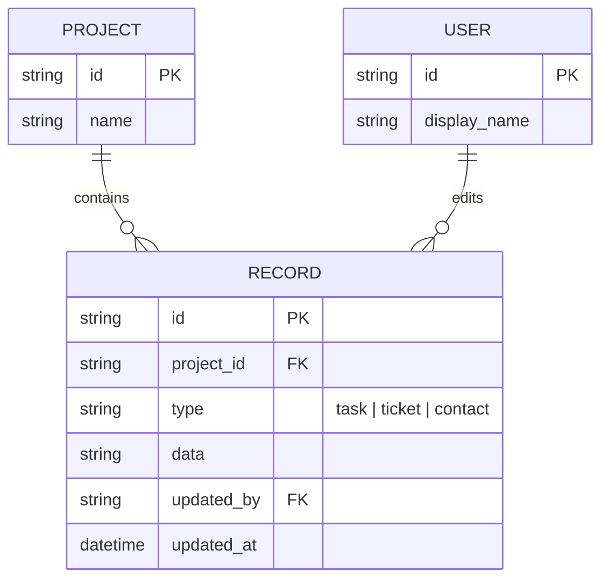

# Base ERD — SaaS dashboard trước khi có cache IndexedDB offline-first

Đây là **base**: mô hình dữ liệu suy luận từ ngữ cảnh đề bài, mô tả trạng thái hệ thống **trước khi** có cache tầng client bằng IndexedDB. Đề bài nói tới dashboard hiển thị danh sách lớn task/ticket/contact, nên base chỉ cần đủ Organization/Project và Record (gộp chung task/ticket/contact) ở phía server, đọc/ghi trực tiếp qua API mỗi lần. Chưa có bất kỳ entity nào phía client (cache, outbox, schema version, quota, metric) — toàn bộ phần đó là enhance.

