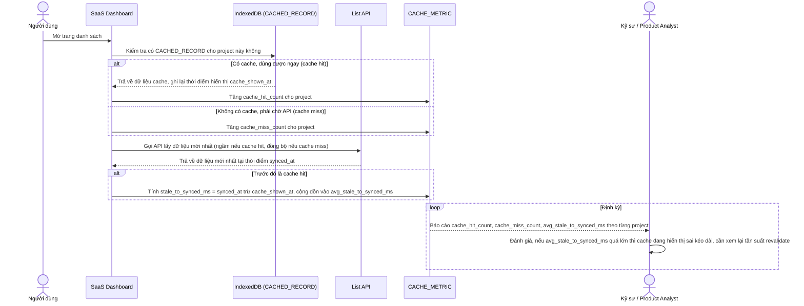

# Enhance sequence — Đo cache hit rate và độ trễ đồng bộ

Đây là **enhance**, flow hoàn toàn mới, đáp ứng yêu cầu 5 của đề bài: đo tỉ lệ cache hit của IndexedDB so với phải gọi API, và độ trễ giữa lúc hiển thị từ cache tới lúc đồng bộ xong dữ liệu mới nhất, để biết cache có thực sự giúp ích hay đang gây hiển thị sai kéo dài.

