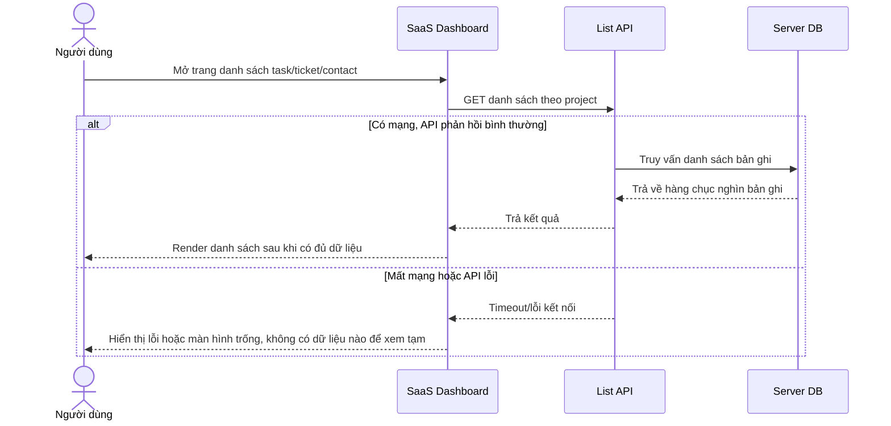

# Base sequence — Load list (luôn gọi API trực tiếp, không có cache)

Đây là **base**, flow tải danh sách bản ghi (task/ticket/contact) ở trạng thái trước enhance. Mỗi lần vào trang, dashboard gọi thẳng API lấy dữ liệu, chờ phản hồi rồi mới render, không có bất kỳ cache cục bộ nào. Nếu mất mạng, người dùng chỉ thấy lỗi hoặc màn hình trống. Flow này là nền để so sánh với flow cùng tên ở enhance, nơi IndexedDB được đọc trước để hiển thị ngay.

