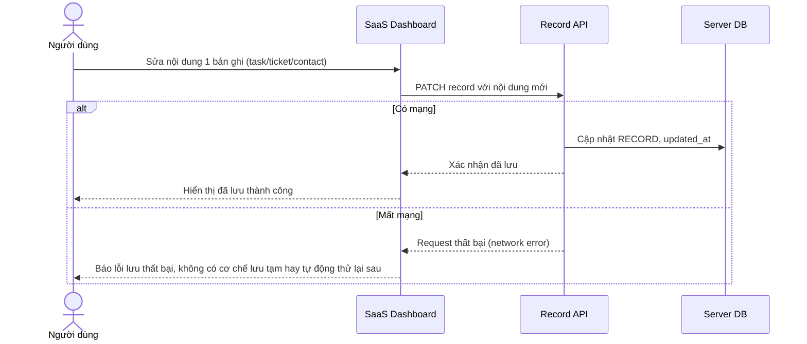

# Base sequence — Edit record (ghi thẳng server, thất bại ngay khi offline)

Đây là **base**, flow chỉnh sửa 1 bản ghi ở trạng thái trước enhance. Mọi thao tác sửa/xoá đều gọi thẳng API, không có bước lưu tạm cục bộ nào. Khi mất mạng, thao tác thất bại ngay lập tức và có thể mất nội dung vừa sửa. Flow này là nền để so sánh với flow cùng tên ở enhance, nơi thao tác offline được ghi vào outbox để replay sau.

