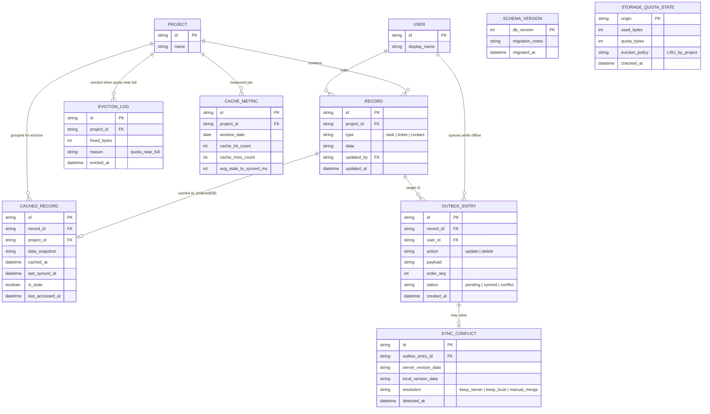

# Enhance ERD — Cache offline-first bằng IndexedDB

Đây là ERD **sau khi** enhance được áp dụng lên base. So với base (chỉ có PROJECT/RECORD ở server), phần enhance thêm 6 nhóm entity mới ở phía client (IndexedDB) và đo lường, ứng trực tiếp với các yêu cầu trong đề bài:

- `CACHED_RECORD` (mới, IndexedDB) — bản snapshot record để hiển thị ngay, kèm `last_synced_at` và `is_stale` để biết đang hiển thị dữ liệu cũ hay đã đồng bộ — yêu cầu 1.
- `SCHEMA_VERSION` (mới, meta trong IndexedDB) — theo dõi version schema hiện tại của database cục bộ, phục vụ `onupgradeneeded` migration — yêu cầu 2.
- `OUTBOX_ENTRY` (mới, IndexedDB) — hàng đợi thao tác sửa/xoá thực hiện lúc offline, có `order_seq` để replay đúng thứ tự — yêu cầu 3.
- `SYNC_CONFLICT` (mới) — ghi nhận khi 1 outbox entry replay lên server nhưng bản ghi đã bị người khác sửa trong lúc offline — yêu cầu 3.
- `STORAGE_QUOTA_STATE` + `EVICTION_LOG` (mới) — theo dõi dung lượng IndexedDB đã dùng so với quota per-origin, và lịch sử eviction theo project ít dùng nhất (LRU) — yêu cầu 4.
- `CACHE_METRIC` (mới) — tỉ lệ cache hit so với phải gọi API, và độ trễ từ lúc hiển thị cache tới lúc đồng bộ xong dữ liệu mới nhất — yêu cầu 5.

