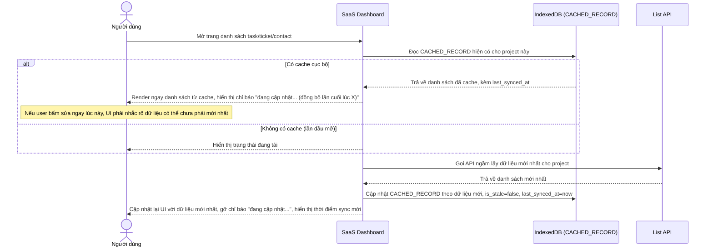

# Enhance sequence — Load list (stale-while-revalidate, có chỉ báo trạng thái sync)

Đây là **enhance**, cùng flow "load-list" như ở base nhưng thay đổi chiến lược: đọc từ IndexedDB hiển thị ngay lập tức, đồng thời gọi API ngầm để lấy bản mới nhất rồi cập nhật lại UI + IndexedDB. Vì dữ liệu hiển thị ban đầu có thể là stale, hệ thống phải có chỉ báo rõ ràng ("đang cập nhật..." hoặc thời điểm sync gần nhất) để user không nhầm tưởng đây là dữ liệu mới nhất. Đáp ứng yêu cầu 1 của đề bài.

