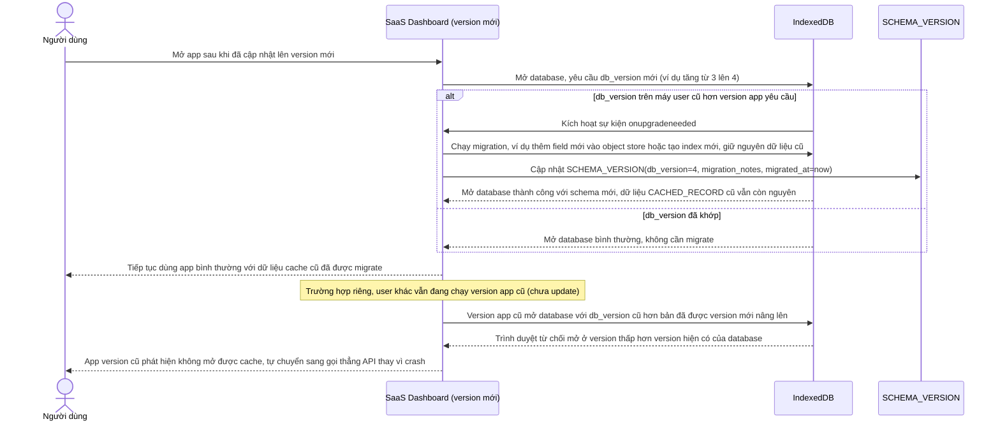

# Enhance sequence — Migration schema IndexedDB giữa các version app

Đây là **enhance**, flow hoàn toàn mới, xử lý việc đổi schema lưu trong IndexedDB giữa các version app (thêm field, đổi cấu trúc object store). Phải dùng cơ chế `onupgradeneeded` để migrate mà không làm mất dữ liệu cache cũ, và không được crash app cho user đang chạy version cũ chưa kịp cập nhật. Đáp ứng yêu cầu 2 của đề bài.

