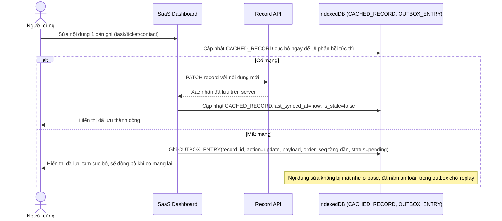

# Enhance sequence — Edit record (ghi vào outbox khi offline thay vì thất bại ngay)

Đây là **enhance**, cùng flow "edit-record" như ở base nhưng thay đổi hành vi khi mất mạng: thay vì thất bại ngay, thao tác sửa/xoá được ghi vào outbox trong IndexedDB kèm thứ tự thực hiện, để replay lên server khi có mạng lại (chi tiết replay và xử lý conflict ở flow outbox-replay-conflict riêng). Đáp ứng phần đầu của yêu cầu 3 của đề bài.

