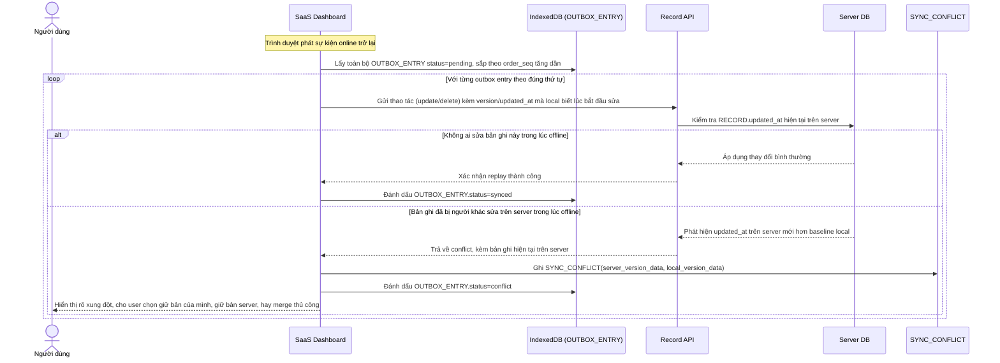

# Enhance sequence — Replay outbox khi có mạng lại, xử lý conflict

Đây là **enhance**, flow hoàn toàn mới, tiếp nối flow "edit-record" khi mạng có lại. Các thao tác offline đã ghi trong outbox phải được replay đúng thứ tự (`order_seq`) lên server, và phải xử lý rõ trường hợp bản ghi đó đã bị người khác sửa trên server trong lúc offline. Đáp ứng phần sau của yêu cầu 3 của đề bài.

