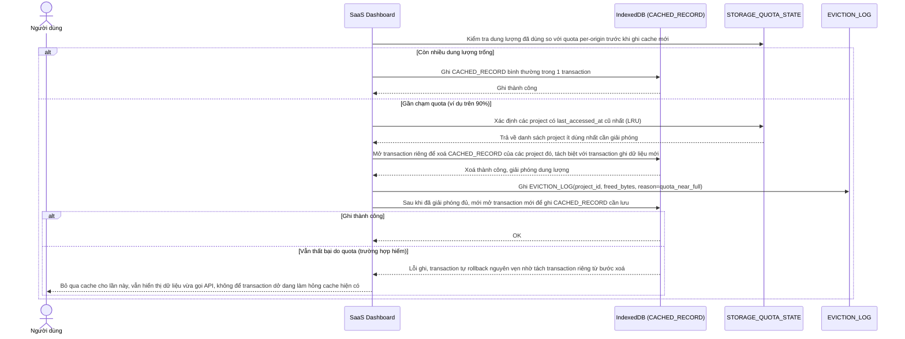

# Enhance sequence — Eviction khi gần chạm quota IndexedDB

Đây là **enhance**, flow hoàn toàn mới, xử lý giới hạn dung lượng IndexedDB theo quota per-origin của trình duyệt. Khi gần chạm quota, hệ thống phải áp dụng chiến lược eviction LRU theo project ít dùng nhất, và tránh để lỗi ghi thất bại giữa chừng làm hỏng transaction đang dở. Đáp ứng yêu cầu 4 của đề bài.

