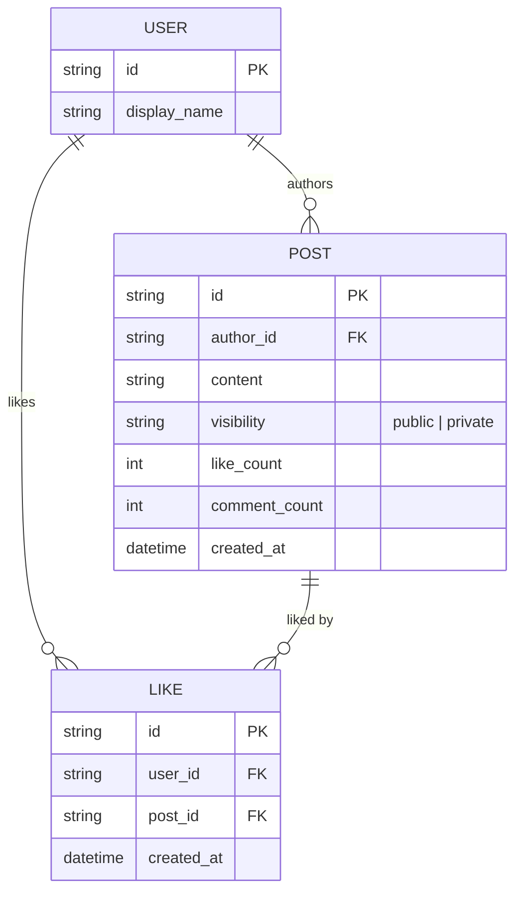

# Base ERD — Mạng xã hội feed infinite scroll trước khi có khôi phục scroll/đồng bộ đa tab

Đây là **base**: mô hình dữ liệu suy luận từ ngữ cảnh đề bài, mô tả trạng thái hệ thống **trước khi** áp enhance. Đề bài nói tới feed infinite scroll, bài viết, like/comment, và trạng thái đọc — nên base chỉ cần đủ User, Post, Like để feed hoạt động bình thường ở phía server. Chưa có bất kỳ entity/cấu trúc nào phía client (sessionStorage, cache theo tab, đồng bộ đa tab) — toàn bộ phần đó là enhance.

