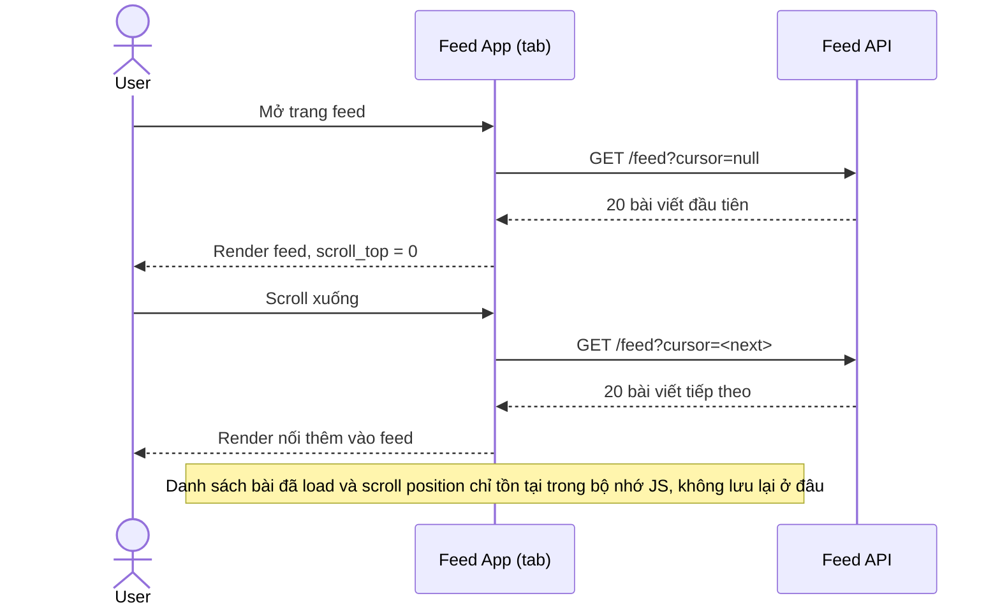

# Base sequence — Load feed infinite scroll

Đây là **base**, flow "Tải feed dạng infinite scroll" ở trạng thái hiện tại — mỗi lần cần thêm bài viết, client luôn gọi API lấy trang tiếp theo, không lưu lại danh sách đã load ở đâu cả. Flow này là tiền đề cho enhance vì yêu cầu 1 của đề bài chính là bắt đầu lưu lại đúng những gì flow này đã tải.

