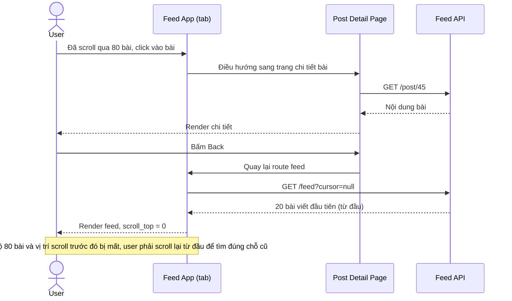

# Base sequence — Xem chi tiết bài viết rồi bấm Back

Đây là **base**, flow "Click vào 1 bài viết rồi bấm Back" ở trạng thái hiện tại — khi quay lại, trang feed bị tải lại hoàn toàn từ đầu, mất scroll position và phải gọi lại API cho toàn bộ bài đã xem trước đó. Flow này chính là vấn đề mà yêu cầu 1 của đề bài muốn giải quyết.

