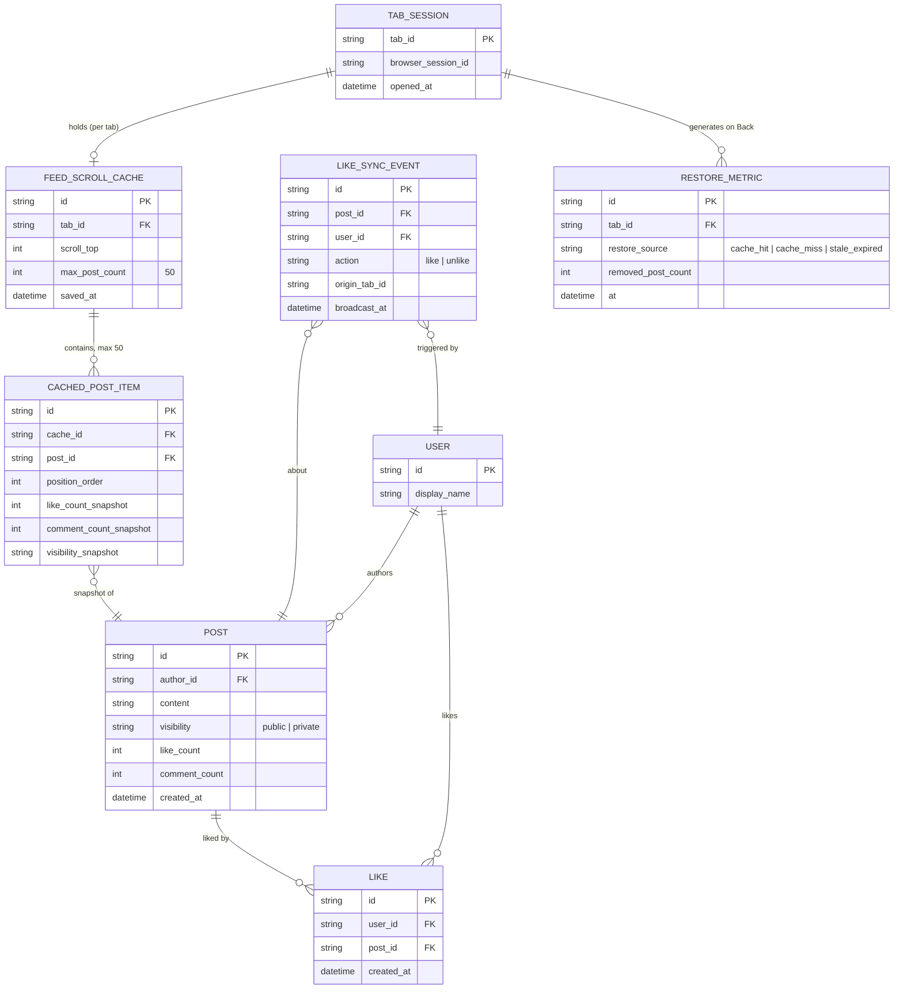

# Enhance ERD — sau khi có cache scroll theo tab và đồng bộ trạng thái đa tab

Đây là ERD **sau khi** enhance được áp dụng lên base. So với base (chỉ có USER/POST/LIKE ở server), phần enhance thêm 4 entity hoàn toàn mới ở phía client, ứng trực tiếp với các yêu cầu trong đề bài:

- `TAB_SESSION` — 1 bản ghi cho mỗi tab đang mở, gắn với sessionStorage riêng của tab đó.
- `FEED_SCROLL_CACHE` (mới) — snapshot scroll position + danh sách bài đã load, lưu trong sessionStorage, giới hạn `max_post_count` (ví dụ 50) — đáp ứng yêu cầu 1.
- `CACHED_POST_ITEM` (mới) — từng bài trong cache, kèm snapshot like/comment count tại thời điểm lưu, để phát hiện dữ liệu đã stale khi bfcache khôi phục — đáp ứng yêu cầu 2.
- `LIKE_SYNC_EVENT` (mới) — sự kiện phát qua BroadcastChannel/`storage` khi like/unlike, để tab khác cùng post đồng bộ theo — đáp ứng yêu cầu 3.
- `RESTORE_METRIC` (mới) — ghi nhận mỗi lần Back là cache-hit hay fallback (cache miss/stale/post bị gỡ), phục vụ đo lường ở yêu cầu 5; trường `removed_post_count` phục vụ yêu cầu 4.

