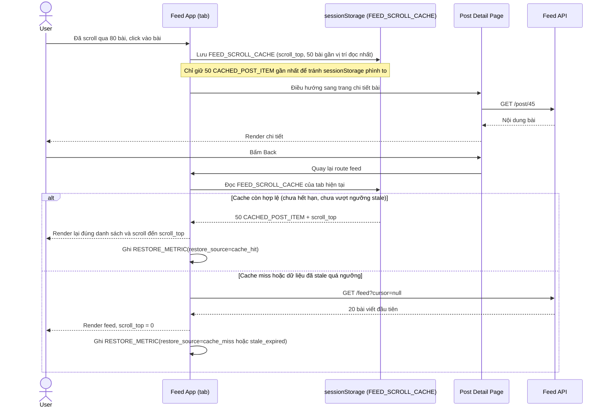

# Enhance sequence — Xem chi tiết bài viết rồi bấm Back (khôi phục từ cache)

Đây là **enhance** của flow đã có ở base (`3-base-view-post-and-back-sqd.md`). So với base, trước khi rời trang feed, App lưu `FEED_SCROLL_CACHE` + tối đa 50 `CACHED_POST_ITEM` gần vị trí scroll nhất vào sessionStorage, khi Back sẽ đọc lại cache thay vì gọi API từ đầu, và ghi nhận `RESTORE_METRIC` để đo tỷ lệ cache-hit — đáp ứng yêu cầu 1 và yêu cầu 5 (đo lường) của đề bài.

