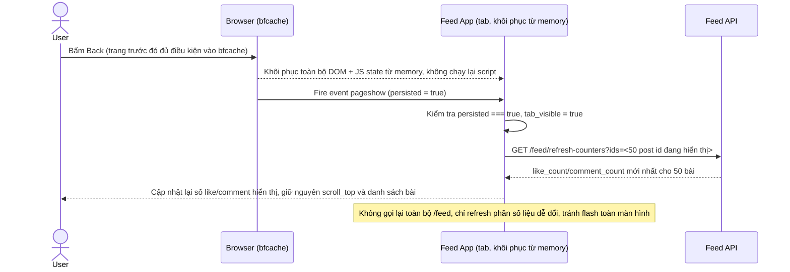

# Enhance sequence — Khôi phục từ bfcache và refresh dữ liệu stale

Đây là **enhance**, flow hoàn toàn mới phát sinh từ enhance — chưa tồn tại ở base vì base chưa từng quan tâm tới bfcache. Khi trình duyệt khôi phục trang từ bfcache (không chạy lại JS), App phải lắng nghe sự kiện `pageshow` với `event.persisted === true` để chủ động refresh những phần dữ liệu dễ đổi (like/comment count) thay vì hiển thị y nguyên trạng thái đóng băng — đáp ứng yêu cầu 2 của đề bài.

