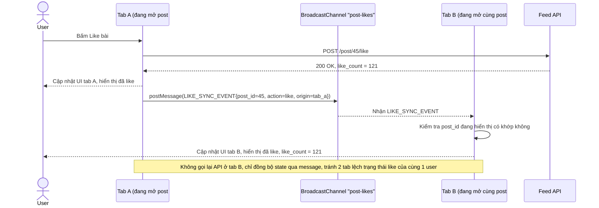

# Enhance sequence — Đồng bộ like/unlike giữa 2 tab

Đây là **enhance**, flow hoàn toàn mới phát sinh từ enhance — ở base mỗi tab like/unlike độc lập, không tab nào biết tab kia vừa đổi trạng thái. Enhance dùng BroadcastChannel (fallback bằng `storage` event) để phát `LIKE_SYNC_EVENT` ngay khi 1 tab like/unlike, các tab khác đang mở cùng post cập nhật UI theo — đáp ứng yêu cầu 3 của đề bài.

