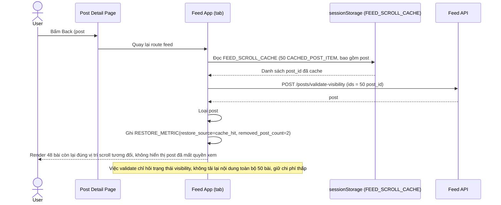

# Enhance sequence — Phát hiện post đã bị xóa/chuyển private khi khôi phục từ cache

Đây là **enhance**, mở rộng thêm cho flow khôi phục ở `5-enhance-view-post-and-back-sqd.md` — trường hợp riêng khi 1 trong 50 post nằm trong `FEED_SCROLL_CACHE` đã bị tác giả xóa hoặc chuyển private trong lúc user đang ở trang khác. Trước khi render lại từ cache, App phải xác thực lại các post_id còn hiệu lực và loại bỏ post không còn quyền xem — đáp ứng yêu cầu 4 của đề bài.

