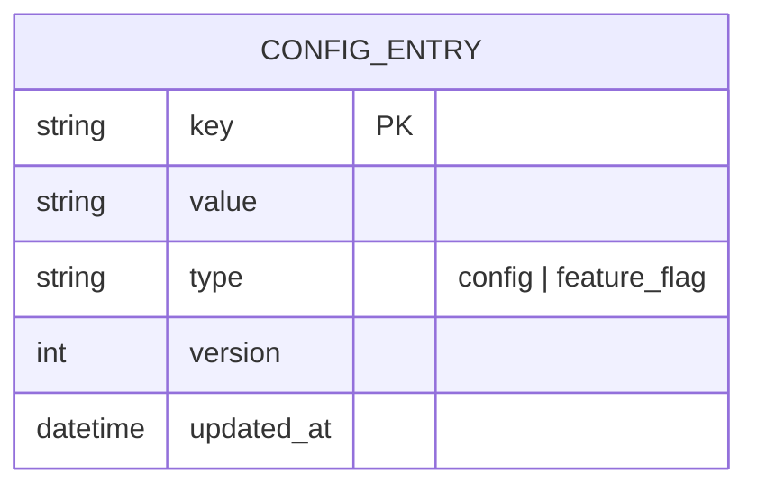

# Base ERD — Config/feature-flag store trước khi có Raft cluster

Đây là **base**: mô hình dữ liệu suy luận trước khi áp Raft. Đề bài mô tả vai trò flow là "dùng Raft để election leader... đảm bảo mọi node đồng thuận" — nghĩa là trước đó hệ thống chỉ là 1 node lưu config duy nhất (single point of failure), chưa có khái niệm cluster/leader/log replication/term. Base chỉ cần entity CONFIG_ENTRY phục vụ đọc/ghi config và feature flag, không có gì liên quan tới đồng thuận.

