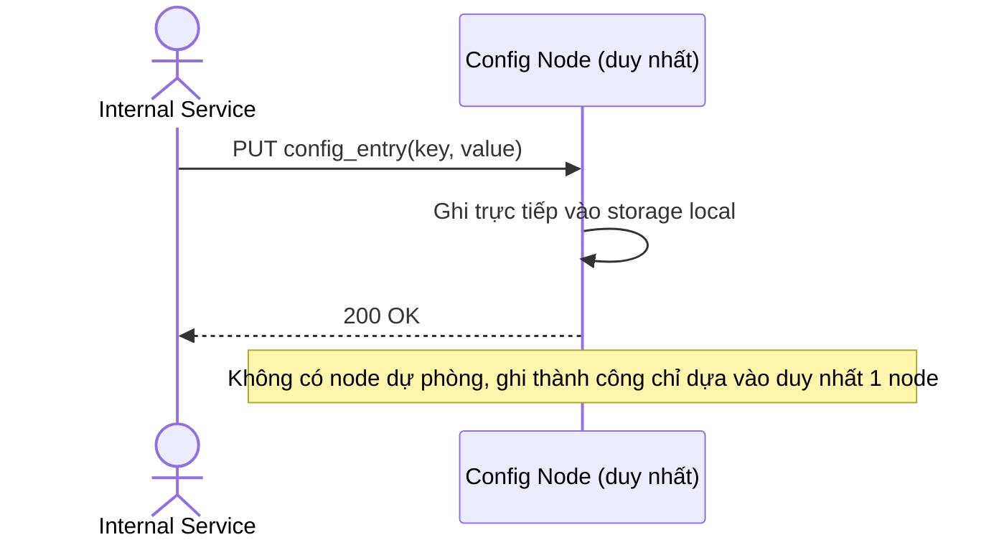

# Base sequence — Ghi config vào node duy nhất

Đây là **base**, flow "Service nội bộ ghi 1 config/feature flag" ở trạng thái hiện tại — chỉ có 1 node duy nhất lưu config, ghi thành công ngay khi node đó xác nhận, không có replication. Flow này là tiền đề cho enhance vì toàn bộ đề bài (Raft, majority commit, term...) chính là để thay thế cơ chế ghi đơn giản và rủi ro này.

