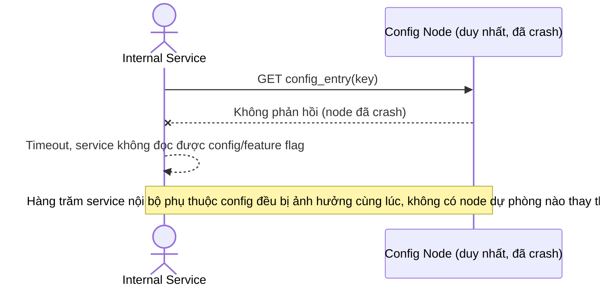

# Base sequence — Node duy nhất chết gây outage toàn cụm

Đây là **base**, mô tả hệ quả trực tiếp của kiến trúc single-node ở flow trước — khi node duy nhất chết, toàn bộ hàng trăm service phụ thuộc config đều mất khả năng đọc/ghi. Đây chính là lý do đề bài yêu cầu dựng Raft cluster 5 node chịu được tối đa 2 node down (yêu cầu 1 của đề bài).

