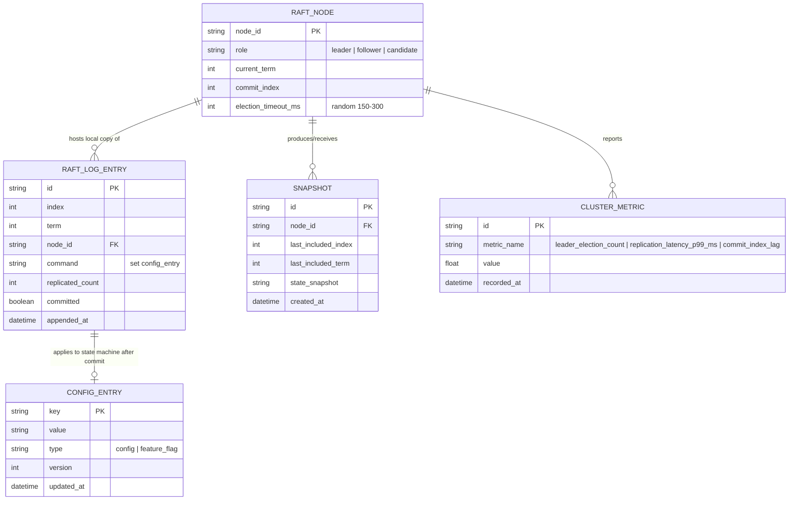

# Enhance ERD — sau khi có Raft cluster 5 node

Đây là ERD **sau khi** enhance được áp dụng lên base. So với base (chỉ có `CONFIG_ENTRY` trên 1 node), enhance thêm 4 nhóm entity mới để mô hình hoá cluster Raft và log đồng thuận, ứng trực tiếp với các yêu cầu trong đề bài:

- `RAFT_NODE` (mới) — 5 node, mỗi node có `role` (leader/follower/candidate), `current_term`, `commit_index` — phục vụ yêu cầu 1 và 4.
- `RAFT_LOG_ENTRY` (mới) — mỗi thay đổi config là 1 log entry, có `term`, `replicated_count`, trạng thái `committed` chỉ true khi đạt majority — phục vụ yêu cầu 3.
- `SNAPSHOT` (mới) — snapshot định kỳ để compact log, follower tụt xa nhận snapshot thay vì replay toàn bộ — phục vụ yêu cầu 5.
- `CLUSTER_METRIC` (mới) — leader election count, replication latency p99, commit index lag — phục vụ yêu cầu đo lường.
- `CONFIG_ENTRY` giữ nguyên nhưng nay là state machine được `apply` sau khi log entry commit, không ghi trực tiếp như base.

