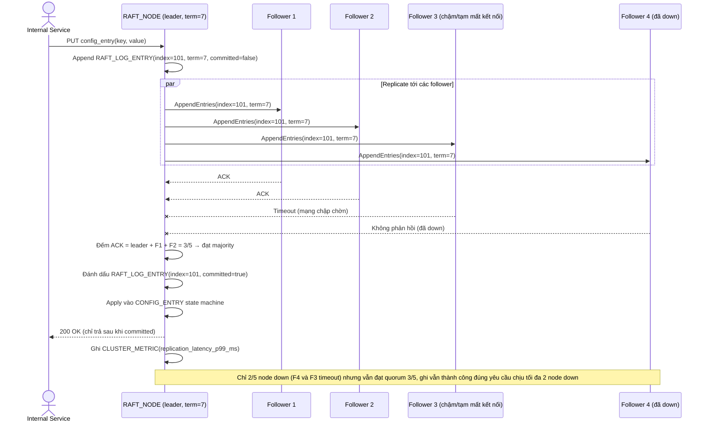

# Enhance sequence — Ghi config qua Raft (commit theo majority)

Đây là **enhance** của flow đã có ở base (`2-base-write-config-sqd.md`). So với base, ghi config nay phải qua leader của cluster 5 node, leader chỉ trả response cho client sau khi log entry đã replicate thành công tới majority (3/5) — đáp ứng yêu cầu 1 và yêu cầu 3 của đề bài, đồng thời expose metric replication latency p99.

