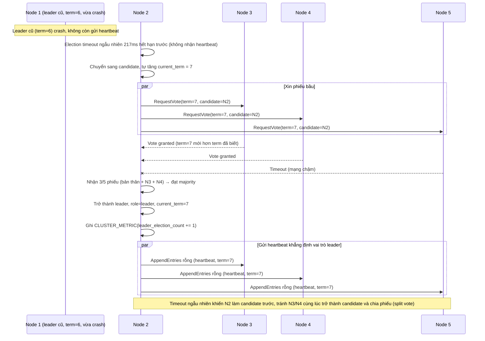

# Enhance sequence — Leader election với randomized timeout

Đây là **enhance**, flow hoàn toàn mới phát sinh từ enhance — chưa tồn tại ở base vì base chỉ có 1 node, không cần bầu leader. Mỗi node dùng election timeout ngẫu nhiên 150-300ms để tránh nhiều node cùng trở thành candidate một lúc (split vote), và term tăng đơn điệu mỗi lần có cuộc bầu mới — đáp ứng yêu cầu 2 và yêu cầu 4 của đề bài, đồng thời expose metric leader election count.

