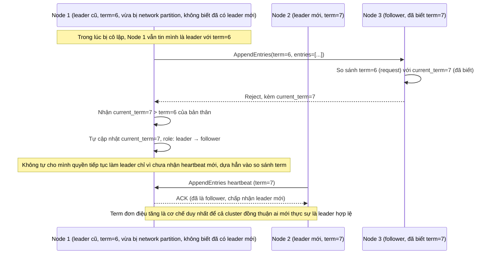

# Enhance sequence — Node từ chối term cũ và tự chuyển về follower

Đây là **enhance**, flow hoàn toàn mới, đi sâu vào 1 khía cạnh riêng của yêu cầu 4 trong đề bài: term phải tăng đơn điệu, node nào nhận request có term thấp hơn phải từ chối, và node đang là leader với term cũ phải tự chuyển về follower ngay khi phát hiện term mới hơn — tránh tình trạng 2 "leader" cùng tồn tại (split-brain do term cũ).

