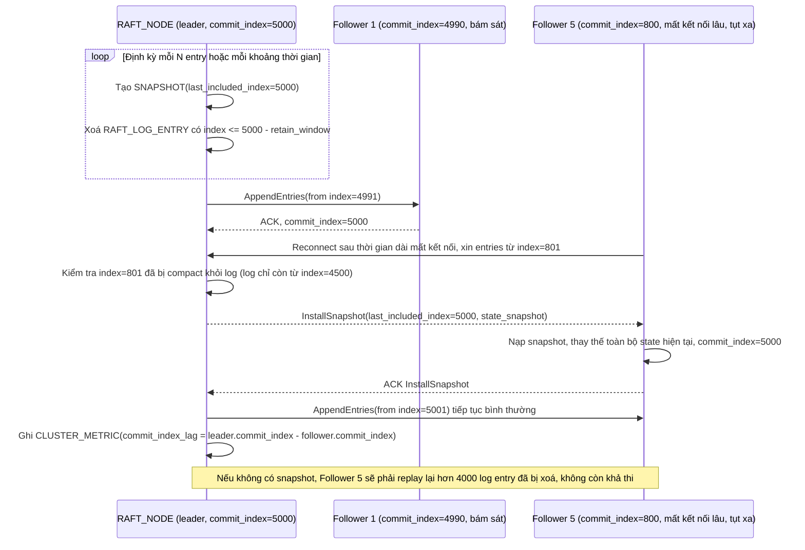

# Enhance sequence — Snapshot/log compaction và follower tụt xa nhận snapshot

Đây là **enhance**, flow hoàn toàn mới phát sinh từ enhance — chưa tồn tại ở base vì base không có log để compact. Mỗi node định kỳ tự tạo `SNAPSHOT` để log không phình vô hạn, và follower bị tụt quá xa (log leader đã compact phần follower cần) sẽ nhận snapshot thay vì replay lại toàn bộ log — đáp ứng yêu cầu 5 của đề bài, đồng thời minh hoạ metric commit index lag.

