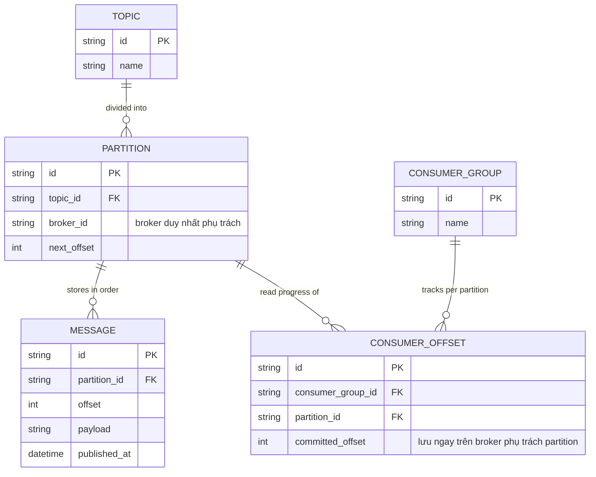

# Base ERD — Message broker tự xây trước khi có consensus giữa các node

Đây là **base**: mô hình dữ liệu suy luận trước khi áp consensus. Đề bài mô tả vai trò flow là "consensus giữa các broker node quyết định thứ tự chính thức của message... khi leader broker chết và broker khác lên thay" — nghĩa là trước đó mỗi partition chỉ do đúng 1 broker phụ trách, không có replica, không có cơ chế bầu lại khi leader chết. Base chỉ cần đủ Topic/Partition/Message để publish-subscribe hoạt động, và offset commit của consumer được lưu ngay trên broker đang phụ trách partition đó (chính điểm này sẽ là vấn đề enhance phải giải quyết).

