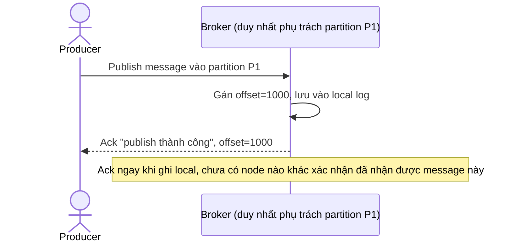

# Base sequence — Publish message (ack ngay khi broker duy nhất nhận được)

Đây là **base**, flow "Producer publish message vào 1 partition" ở trạng thái hiện tại — broker duy nhất phụ trách partition gán offset và ack cho producer ngay khi nhận được, không có replica nào xác nhận. Flow này là tiền đề cho enhance vì yêu cầu 1 của đề bài chính là thay đổi thời điểm ack này.

