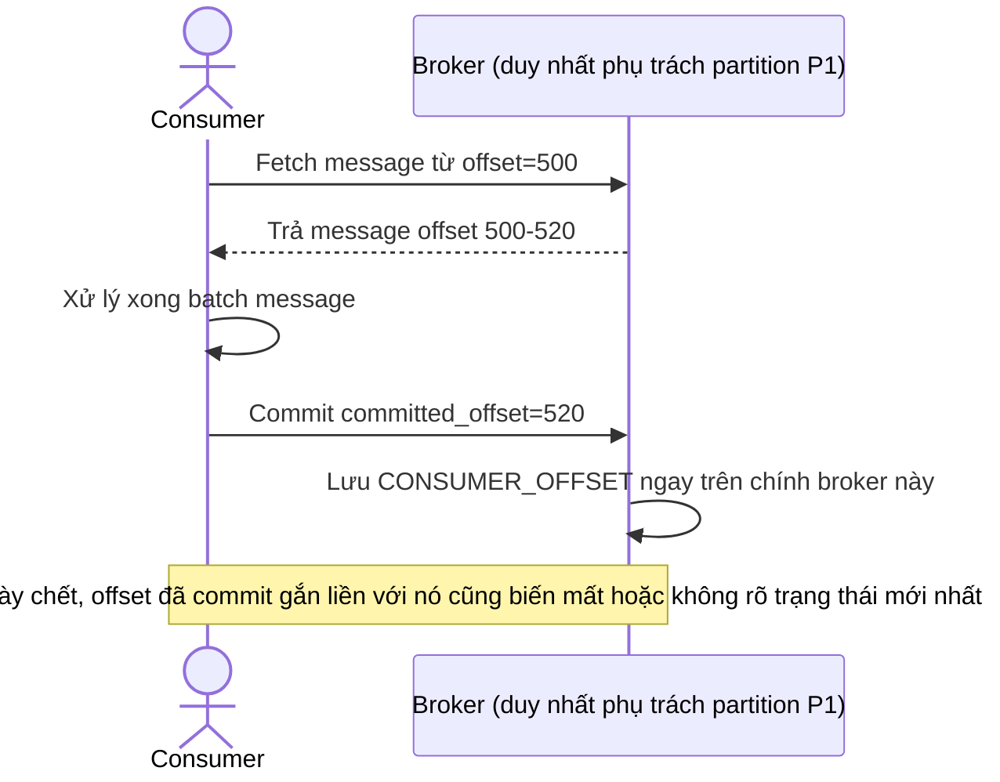

# Base sequence — Consumer đọc message và commit offset

Đây là **base**, flow "Consumer group đọc message từ 1 partition" ở trạng thái hiện tại — offset đã đọc tới đâu (`CONSUMER_OFFSET`) được lưu ngay trên broker duy nhất đang phụ trách partition, gắn chặt với broker đó. Flow này là tiền đề cho enhance vì yêu cầu 4 của đề bài chỉ ra rõ đây là vấn đề khi broker đổi.

