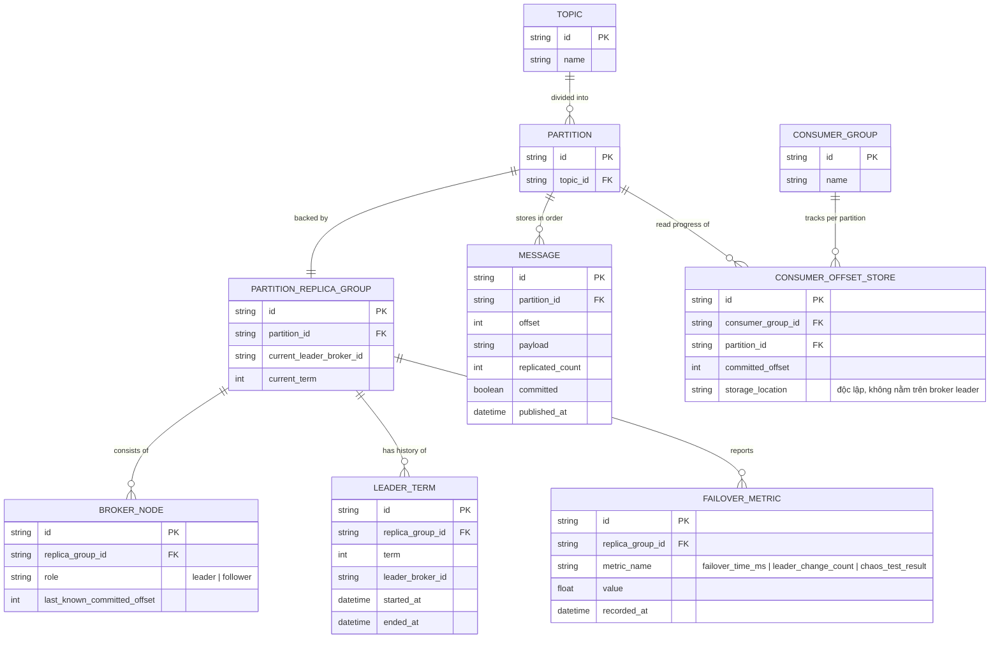

# Enhance ERD — sau khi có consensus giữa broker node theo partition

Đây là ERD **sau khi** enhance được áp dụng lên base. So với base (1 broker/partition, offset commit gắn với broker đó), enhance thêm nhóm entity mô hình hoá replica group + consensus, ứng trực tiếp với các yêu cầu trong đề bài:

- `BROKER_NODE` (mới) và `PARTITION_REPLICA_GROUP` (mới) — mỗi partition nay có nhiều broker node (leader + follower), thay vì 1 broker duy nhất.
- `MESSAGE` thêm `replicated_count`/`committed` — offset chỉ chính thức khi replicate tới majority — đáp ứng yêu cầu 1.
- `LEADER_TERM` (mới) — mỗi lần đổi leader tăng term, phục vụ xác định leader mới xác định đúng last committed offset — đáp ứng yêu cầu 2.
- `CONSUMER_OFFSET` nay thuộc `CONSUMER_OFFSET_STORE` (mới) độc lập với broker leader — đáp ứng yêu cầu 4.
- `FAILOVER_METRIC` (mới) — failover time, tần suất đổi leader, kết quả chaos test — đáp ứng yêu cầu đo lường.

