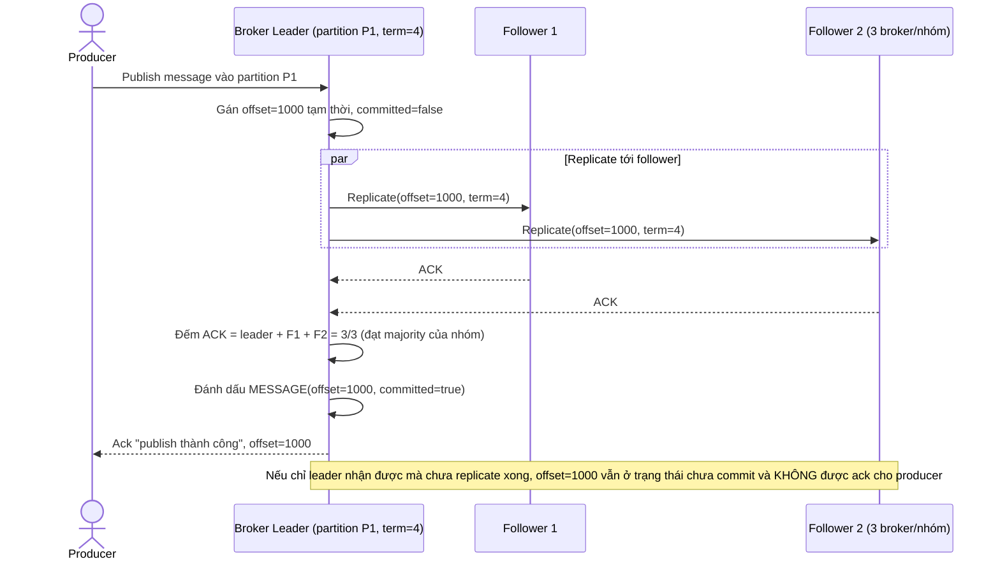

# Enhance sequence — Publish message (ack chỉ sau khi replicate majority)

Đây là **enhance** của flow đã có ở base (`2-base-publish-message-sqd.md`). So với base, offset chỉ được gán và message chỉ coi là "đã publish thành công" (ack cho producer) sau khi leader replicate thành công tới majority broker trong `PARTITION_REPLICA_GROUP`, không phải ngay khi leader nhận được — đáp ứng đúng yêu cầu 1 của đề bài.

