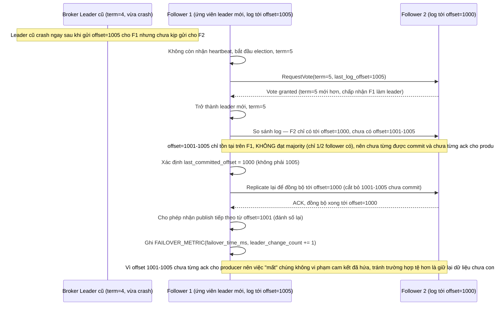

# Enhance sequence — Leader mới xác định đúng offset đã commit trước khi cho publish tiếp

Đây là **enhance**, flow hoàn toàn mới phát sinh từ enhance — chưa tồn tại ở base vì base không có replica nên không có khái niệm "leader mới". Khi leader cũ chết đột ngột, broker mới lên thay phải so sánh log giữa các follower còn sống để xác định chính xác offset cuối cùng đã replicate đủ majority, tránh chọn nhầm offset dựa trên log chưa commit đầy đủ — đáp ứng đúng yêu cầu 2 của đề bài, đồng thời ghi nhận `failover_time_ms`.

