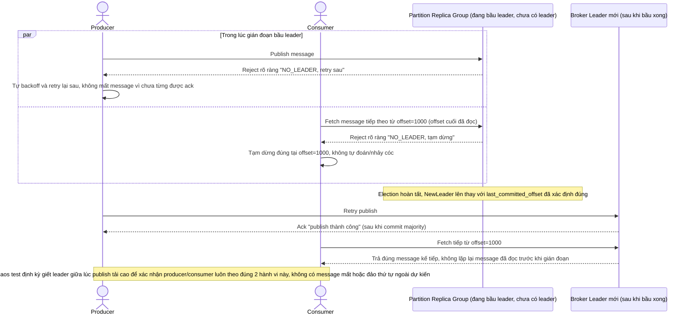

# Enhance sequence — Hành vi producer/consumer trong lúc đang bầu leader mới

Đây là **enhance**, flow hoàn toàn mới phát sinh từ enhance — chưa tồn tại ở base vì base không có giai đoạn gián đoạn do bầu lại leader. Trong lúc chưa có leader mới, producer bị từ chối rõ ràng để tự retry (không buffer ngầm phía broker), còn consumer tạm dừng đúng tại offset cuối đã đọc, không đọc nhảy cóc hay đọc trùng khi kết nối lại broker mới — đáp ứng đúng yêu cầu 3 của đề bài. Cụm cũng chạy chaos test định kỳ mô phỏng đúng kịch bản này dưới tải cao (yêu cầu đo lường).

