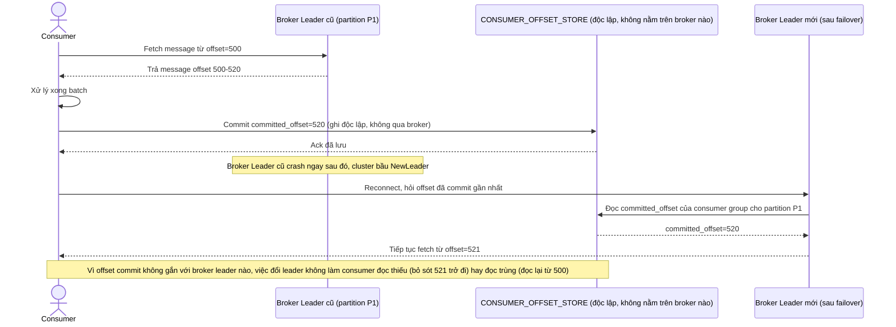

# Enhance sequence — Consumer commit offset vào store độc lập với broker leader

Đây là **enhance** của flow đã có ở base (`3-base-consume-message-sqd.md`). So với base (offset lưu ngay trên broker duy nhất phụ trách partition), nay `CONSUMER_OFFSET_STORE` là 1 storage độc lập, tách rời khỏi broker leader hiện tại — khi leader đổi, consumer reconnect vào broker mới vẫn đọc đúng từ vị trí đã dừng, không đọc thiếu hoặc đọc trùng không kiểm soát — đáp ứng đúng yêu cầu 4 của đề bài.

