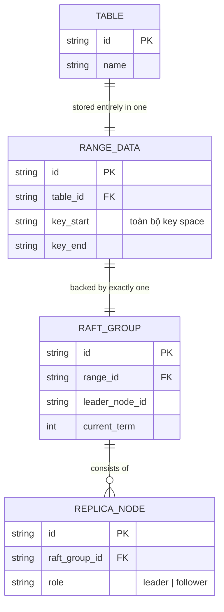

# Base ERD — Distributed SQL DB trước khi chia range/multi-raft

Đây là **base**: mô hình dữ liệu suy luận trước khi áp sharding theo range. Đề bài mô tả vai trò flow là "mỗi range chạy Raft riêng để đồng thuận... multi-raft trên cùng cluster" — nghĩa là trước đó toàn bộ dữ liệu của bảng nằm trong đúng 1 range duy nhất, chạy đúng 1 Raft group duy nhất cho cả bảng, chưa có khái niệm chia nhỏ theo range hay client phải tìm đúng leader của từng range (vì chỉ có 1 leader duy nhất cho toàn bộ dữ liệu).

