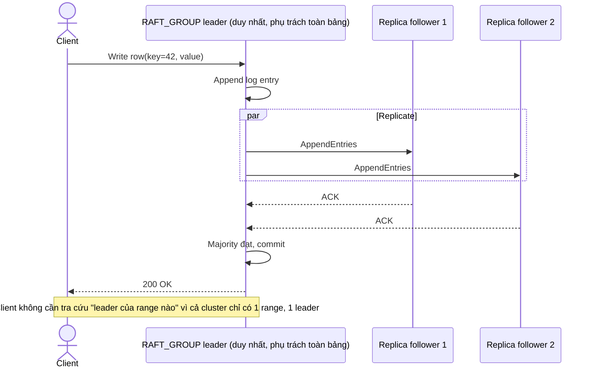

# Base sequence — Ghi dữ liệu (chỉ 1 range, 1 leader duy nhất)

Đây là **base**, flow "Client ghi dữ liệu" ở trạng thái hiện tại — vì toàn bộ bảng chỉ nằm trong 1 range với đúng 1 Raft group, client luôn biết chắc phải gửi tới đâu (không có nhiều range/nhiều leader để chọn nhầm). Flow này là tiền đề cho enhance vì khi bảng được chia thành nhiều range (yêu cầu 1, 2, 3), bài toán "gửi đúng leader" mới thực sự phát sinh.

