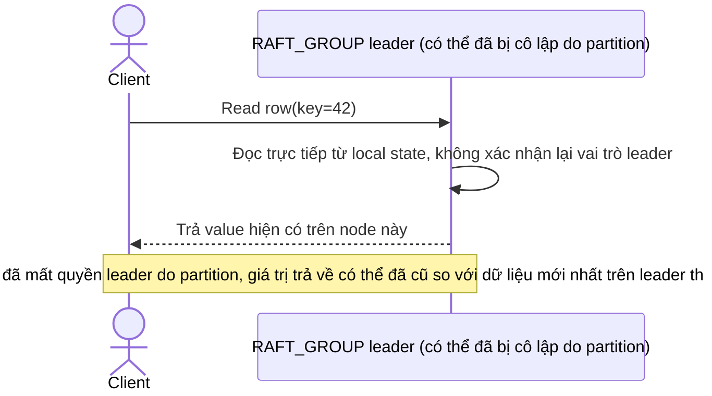

# Base sequence — Đọc dữ liệu trực tiếp từ leader (chưa xác nhận vẫn còn là leader hợp lệ)

Đây là **base**, flow "Client đọc dữ liệu" ở trạng thái hiện tại — leader trả kết quả ngay từ local state mà không xác nhận lại mình còn thực sự là leader hợp lệ tại thời điểm đọc. Bình thường không sao, nhưng trong lúc network partition, 1 node có thể vẫn tưởng mình là leader dù cluster đã bầu leader mới, dẫn tới đọc dữ liệu cũ (stale read). Flow này là tiền đề cho enhance vì yêu cầu 4 của đề bài chính là bổ sung bước xác nhận này.

