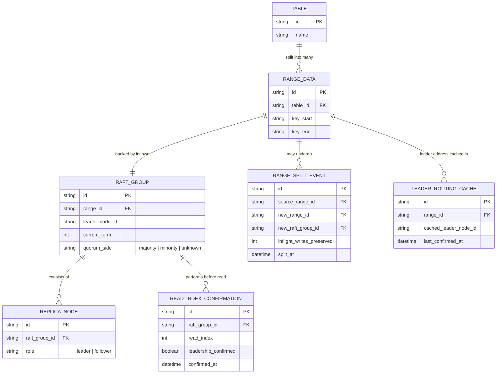

# Enhance ERD — sau khi chia range/multi-raft và client routing

Đây là ERD **sau khi** enhance được áp dụng lên base. So với base (1 range, 1 Raft group duy nhất cho cả bảng), enhance thêm cấu trúc multi-raft và routing thông tin, ứng trực tiếp với các yêu cầu trong đề bài:

- `RANGE_DATA` nay là nhiều bản ghi (nhiều range), mỗi range có `RAFT_GROUP` độc lập của riêng nó, leader các range có thể ở node khác nhau — đáp ứng yêu cầu 1.
- `RANGE_SPLIT_EVENT` (mới) — ghi nhận việc range bị split và Raft group mới được tạo ra cho phần tách, kèm trạng thái write inflight tại thời điểm split — đáp ứng yêu cầu 2.
- `LEADER_ROUTING_CACHE` (mới) — client cache địa chỉ leader hiện tại của từng range, cập nhật khi nhận `NotLeader`/redirect — đáp ứng yêu cầu 3.
- `READ_INDEX_CONFIRMATION` (mới) — leader xác nhận vẫn còn hợp lệ bằng heartbeat/read-index trước khi trả kết quả đọc — đáp ứng yêu cầu 4.
- `RAFT_GROUP` thêm `quorum_side` để phản ánh trạng thái majority/minority khi cluster bị network partition — đáp ứng yêu cầu 5.

