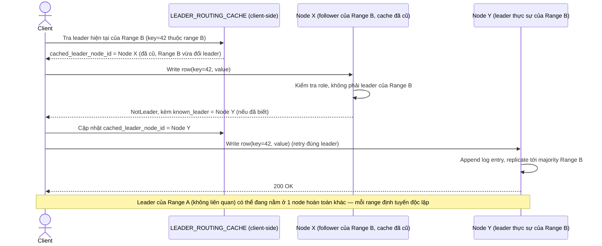

# Enhance sequence — Ghi dữ liệu đúng leader của range (multi-raft + redirect)

Đây là **enhance** của flow đã có ở base (`2-base-write-sqd.md`). So với base (chỉ 1 range nên không cần định tuyến), nay bảng chia thành nhiều range, mỗi range có `RAFT_GROUP` riêng với leader có thể ở node khác nhau — client phải luôn được route tới đúng leader hiện tại, nếu gửi nhầm follower sẽ nhận lại redirect hoặc lỗi NotLeader — đáp ứng đúng yêu cầu 1 và yêu cầu 3 của đề bài.

