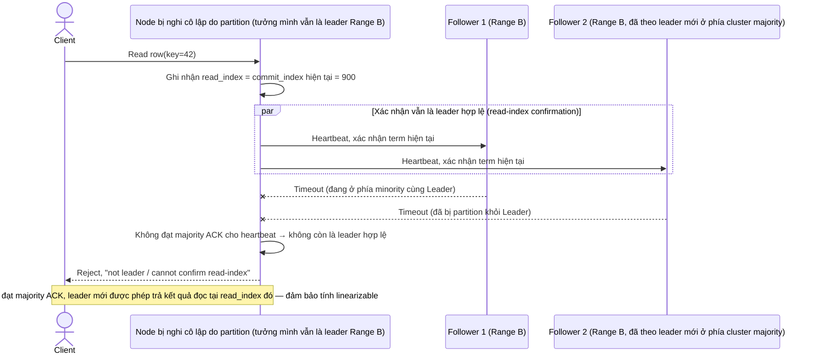

# Enhance sequence — Đọc linearizable qua read-index/heartbeat

Đây là **enhance** của flow đã có ở base (`3-base-read-sqd.md`). So với base (leader trả kết quả ngay không xác nhận vai trò), nay leader phải gửi heartbeat/read-index tới majority replica để xác nhận vẫn còn là leader hợp lệ trước khi trả kết quả đọc, tránh trả dữ liệu cũ khi đang bị network partition cô lập — đáp ứng đúng yêu cầu 4 của đề bài.

