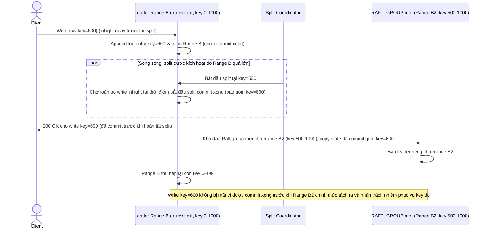

# Enhance sequence — Range split tạo Raft group mới không mất write inflight

Đây là **enhance**, flow hoàn toàn mới phát sinh từ enhance — chưa tồn tại ở base vì base chỉ có 1 range cố định, không bao giờ split. Khi 1 range quá lớn, hệ thống tạo Raft group mới cho phần tách ra, và phải đảm bảo write đang inflight tại thời điểm split (đã gửi tới leader cũ, chưa kịp ack) không bị mất — đáp ứng đúng yêu cầu 2 của đề bài.

