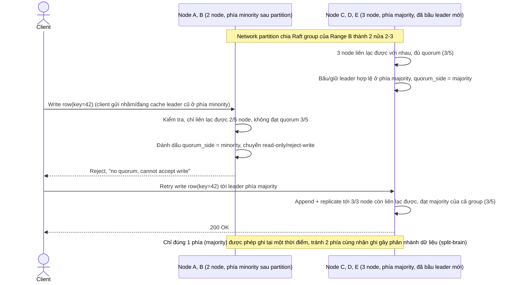

# Enhance sequence — Network partition chia cluster, phía minority từ chối ghi

Đây là **enhance**, flow hoàn toàn mới phát sinh từ enhance — ở base cluster nhỏ và giả định không tách nhóm khi partition (không được đề cập). Enhance yêu cầu xử lý rõ kịch bản network partition chia cluster của 1 Raft group thành 2 nửa (ví dụ 2-3 hoặc 3-2), phía không đủ quorum tuyệt đối không được nhận ghi — đáp ứng đúng yêu cầu 5 của đề bài.

