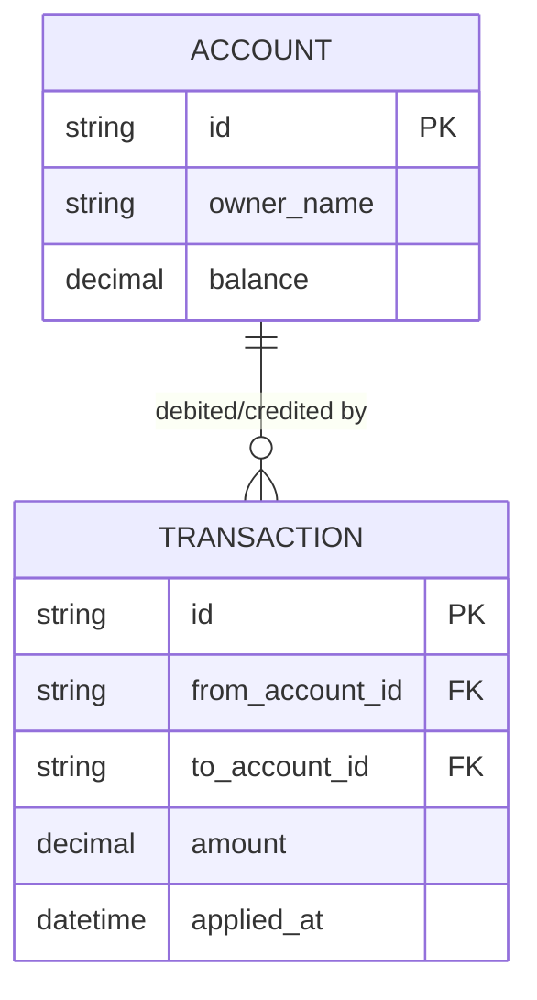

# Base ERD — Ledger tài chính trước khi có consensus

Đây là **base**: mô hình dữ liệu suy luận trước khi áp consensus. Đề bài mô tả vai trò flow là "consensus đảm bảo mọi giao dịch được ghi theo đúng 1 thứ tự duy nhất và toàn bộ cluster đồng thuận" — nghĩa là trước đó ledger chạy trên 1 node duy nhất, apply giao dịch ngay khi nhận được, không có log replication, không có cơ chế idempotency để chống double-apply khi client retry. Base chỉ cần đủ ACCOUNT và TRANSACTION cho nghiệp vụ ghi nhận giao dịch cơ bản.

