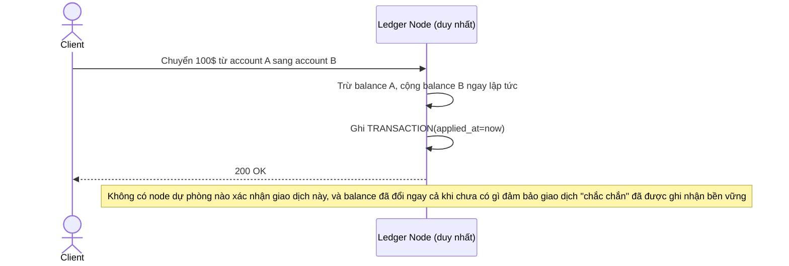

# Base sequence — Apply giao dịch ngay khi node nhận được

Đây là **base**, flow "Ghi nhận 1 giao dịch chuyển tiền" ở trạng thái hiện tại — node duy nhất cập nhật `balance` ngay khi nhận request, không có bước replicate hay chờ commit nào. Flow này là tiền đề cho enhance vì yêu cầu 1 của đề bài chính là tách rõ 2 bước "commit" và "apply", vốn ở base đang gộp làm một.

