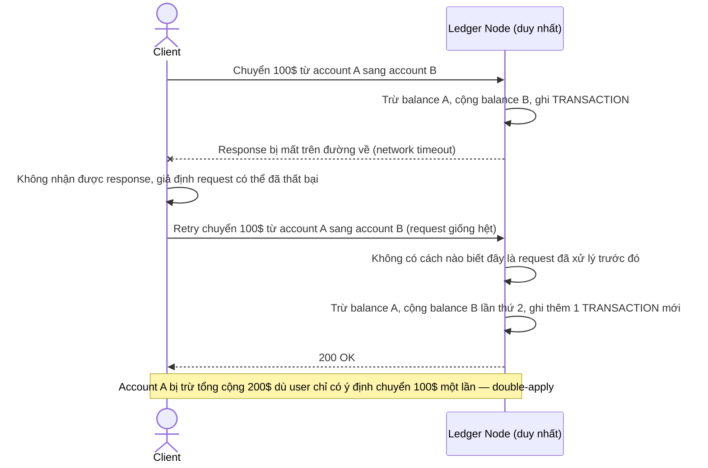

# Base sequence — Client retry sau timeout gây double-apply

Đây là **base**, mô tả 1 hệ quả trực tiếp của flow apply ở trên — khi client không nhận được response do timeout (dù giao dịch thực ra đã apply thành công), client tự retry và ledger apply lại lần nữa vì không có gì để nhận diện đây là cùng 1 giao dịch. Đây chính là vấn đề mà yêu cầu 4 (idempotency) trong đề bài muốn giải quyết.

