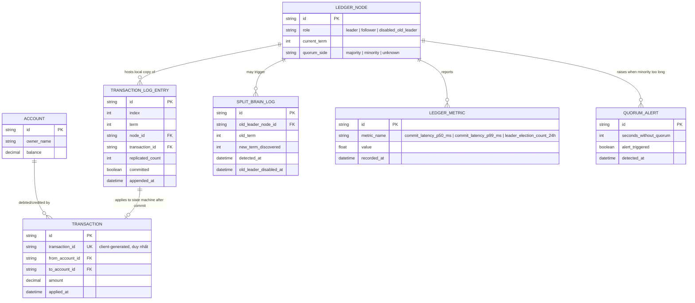

# Enhance ERD — sau khi có Raft cluster cho ledger

Đây là ERD **sau khi** enhance được áp dụng lên base. So với base (1 node, apply ngay, không idempotency), enhance thêm 4 nhóm entity mới, ứng trực tiếp với các yêu cầu trong đề bài:

- `LEDGER_NODE` (mới) — cluster nhiều node, mỗi node có `role`, `current_term`, `quorum_side` — nền tảng cho yêu cầu 1, 2, 3.
- `TRANSACTION_LOG_ENTRY` (mới) — mỗi giao dịch trước tiên là 1 log entry với `committed` (chỉ true sau majority), `TRANSACTION`/`ACCOUNT` chỉ được apply sau khi entry này commit — đáp ứng yêu cầu 1.
- `TRANSACTION` thêm `transaction_id` duy nhất do client sinh ra, dùng để chống double-apply khi retry — đáp ứng yêu cầu 4.
- `SPLIT_BRAIN_LOG` (mới) — ghi nhận mỗi lần phát hiện 2 leader cùng tồn tại do term cũ và việc tự vô hiệu hoá leader cũ — đáp ứng yêu cầu 3.
- `LEDGER_METRIC`/`QUORUM_ALERT` (mới) — commit latency p50/p99, leader election count 24h, alert mất quorum — đáp ứng yêu cầu đo lường.

